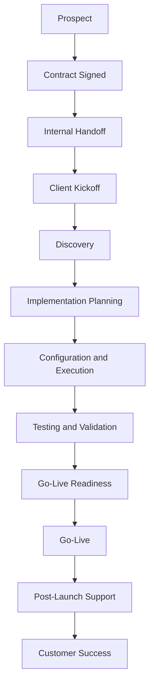

Client Implementation Playbook

Enterprise Client Onboarding & Implementation Framework

Badges

🚀 New Here?

Start with the Getting Started Guide...

A practical collection... of workflows, templates, checklists, and documentation for successful client onboarding, implementation, and customer success.

---

## 📚 Table of Contents

- [Purpose](#-purpose)
- [Client Implementation Lifecycle](#-client-implementation-lifecycle)
- [Repository Structure](#-repository-structure)
- [Featured Resources](#-featured-resources)
- [Implementation Principles](#-implementation-principles)
- [Project Roadmap](#-project-roadmap)
- [About the Creator](#-about-the-creator)

---

## 🎯 Purpose

Successful client implementations require more than completing tasks.

They require clear communication, documented expectations, stakeholder alignment, risk management, testing, operational readiness, and a thoughtful transition into ongoing customer success.

I created this repository to demonstrate my approach to:

- Client onboarding
- Client implementation
- SOW and SLA alignment
- Stakeholder communication
- Project coordination
- Risk and issue management
- Go-live preparation
- Documentation
- Customer success

---

## 🔄 Client Implementation Lifecycle

### Lifecycle Stages

1. **Contract Signed**  
   Confirm the scope, deliverables, responsibilities, SOW requirements, SLA expectations, and success criteria.

2. **Internal Handoff**  
   Transfer information from sales, recruiting, account management, or business development to the implementation team.

3. **Client Kickoff**  
   Introduce stakeholders, confirm goals, review scope, establish communication expectations, and align on the timeline.

4. **Discovery**  
   Gather business, technical, operational, staffing, reporting, security, and workflow requirements.

5. **Implementation**  
   Coordinate deliverables, configure processes, track milestones, manage risks, and communicate progress.

6. **Testing and Validation**  
   Confirm workflows, documentation, systems, responsibilities, reports, and escalation procedures are ready.

7. **Go-Live**  
   Launch the new service, process, account, or program with appropriate support coverage.

8. **Customer Success**  
   Monitor outcomes, resolve issues, collect feedback, review performance, and support the long-term relationship.

---

## 📂 Repository Structure

| Section | Purpose |
|---|---|
| [Onboarding](onboarding/) | Client intake, discovery, welcome materials, and kickoff preparation |
| [Implementation](implementation/) | Project plans, milestones, timelines, risks, testing, and go-live |
| [Customer Success](customer-success/) | Client health, business reviews, retention, and ongoing support |
| [Documentation](documentation/) | SOPs, user guides, knowledge base articles, and process documentation |
| [Templates](templates/) | Reusable project, communication, and operational templates |
| [Workflows](workflows/) | Step-by-step client lifecycle and escalation workflows |
| [Examples](examples/) | Practical examples and sample implementation artifacts |
| [Resources](resources/) | Tools, references, and professional development resources |

---

## ⭐ Featured Resources

### Client Onboarding

- [Client Onboarding Checklist](onboarding/Client-Onboarding-Checklist.md)
- [Client Welcome Email](onboarding/Client-Welcome-Email.md)
- [Discovery Questionnaire](onboarding/Discovery-Questionnaire.md)
- [Kickoff Meeting Agenda](onboarding/Kickoff-Agenda.md)

### Implementation

- [Project Kickoff Template](implementation/Project-Kickoff-Template.md)

### Workflows

- [Client Implementation Workflow](workflows/Client-Implementation-Workflow.md)

### Templates

- [Meeting Minutes Template](templates/Meeting-Minutes-Template.md)
- [Project Charter Template](templates/Project-Charter-Template.md)
- [RAID Log Template](templates/RAID-Log-Template.md)
- [Communication Plan Template](templates/Communication-Plan-Template.md)

Additional implementation tools will be added as the portfolio develops.

---

## 🧭 Implementation Principles

My approach is guided by five principles:

### 1. Start With Alignment

All stakeholders should understand the scope, timeline, responsibilities, deliverables, risks, and success criteria.

### 2. Document Decisions

Important requirements, approvals, changes, risks, and action items should be documented and accessible.

### 3. Communicate Proactively

Clients should not have to chase the implementation team for updates.

### 4. Prepare for Risk

Risks and dependencies should be identified early, assigned to an owner, and monitored throughout the project.

### 5. Design for Long-Term Success

A successful implementation should create a smooth transition into support, account management, and customer success.

---

## 🗺️ Project Roadmap

### Completed

- [x] Repository structure
- [x] Main repository documentation
- [x] Client implementation lifecycle
- [x] Client onboarding checklist
- [x] Client welcome email
- [x] Discovery questionnaire
- [x] Kickoff meeting agenda
- [x] Project kickoff template

### In Development

- [ ] Implementation timeline
- [ ] Risk register
- [ ] Weekly status report
- [ ] Go-live readiness checklist
- [ ] Escalation workflow
- [ ] Lessons learned template
- [ ] Customer success plan
- [ ] Quarterly business review template
- [ ] Sample implementation case study

---

## 👩🏾‍💼 About the Creator

I'm Chanel Sius, a business and technology professional with experience in:

- Full-cycle recruiting
- Staffing operations
- Client onboarding
- Client implementation
- Customer and client support
- BPO operations
- SOW and SLA execution
- Process improvement
- Cross-functional coordination
- Technical and business operations

I created this portfolio to demonstrate how I organize client implementations, translate contractual requirements into operational workflows, document processes, and support successful client outcomes.

I am also pursuing a **Bachelor of Arts in Communication with a concentration in Organizational Leadership** at the **University of North Georgia**.

### Connect With Me

[LinkedIn](https://www.linkedin.com/in/anjelchanel)  
[GitHub Profile](https://github.com/ChanelSius)

---

⭐ This repository is actively maintained as part of my professional portfolio.
