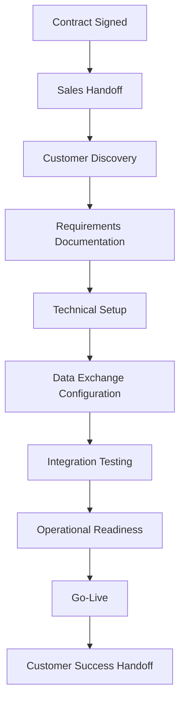
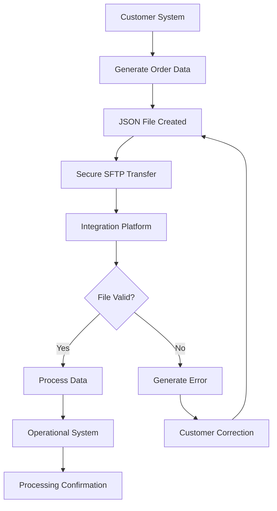
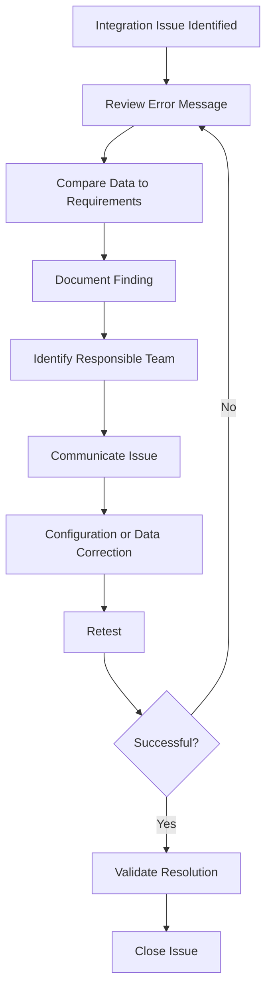
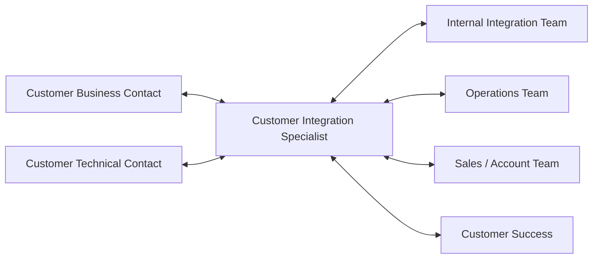

# Customer Integration Case Study

> **Portfolio Simulation:** This case study is a fictional customer integration scenario created to demonstrate customer onboarding, technical coordination, data exchange concepts, issue management, stakeholder communication, testing, and go-live readiness. It does not represent work completed for an actual client.

## Overview

Northstar Home Goods is a fictional e-commerce retailer preparing to integrate its order data with a third-party logistics and delivery provider.

The customer has completed the sales process and signed its service agreement. The Customer Integration Specialist is responsible for coordinating the transition from signed contract through successful go-live while ensuring requirements are documented, technical dependencies are addressed, testing is completed, and stakeholders remain informed.

### Integration Goals

* Establish a secure method for exchanging order data
* Validate required customer data fields
* Coordinate testing between customer and internal technical teams
* Track implementation milestones and dependencies
* Identify and resolve integration issues before production launch
* Prepare operational teams for go-live
* Transition the customer to ongoing support and Customer Success

---

## Customer Profile

| Field                        | Details                 |
| ---------------------------- | ----------------------- |
| Customer                     | Northstar Home Goods    |
| Industry                     | E-commerce / Home Goods |
| Integration Type             | SFTP File Exchange      |
| Data Format                  | JSON                    |
| Data Frequency               | Every 30 minutes        |
| Implementation Environment   | Test → Production       |
| Customer Business Contact    | Operations Manager      |
| Customer Technical Contact   | Integration Engineer    |
| Internal Integration Contact | Integration Specialist  |
| Internal Operations Contact  | Operations Manager      |
| Target Go-Live               | October 15              |
| Project Status               | In Implementation       |

# Customer Integration Lifecycle



The Customer Integration Specialist coordinates the lifecycle rather than performing every technical task directly. The role acts as the bridge between the customer, technical resources, operations teams, and other stakeholders.

# 1. Sales-to-Implementation Handoff

Following contract signature, the implementation process begins with an internal handoff.

### Information Reviewed

* Contracted services
* Customer business requirements
* Expected transaction volume
* Service levels
* Technical integration method
* Customer contacts
* Operational requirements
* Target implementation timeline
* Known risks or dependencies
* Sales commitments requiring validation

### Handoff Objective

Confirm that the implementation team understands what was sold, what must be configured, who owns each activity, and whether any unresolved items could affect the proposed launch date.

# 2. Customer Discovery

A kickoff and discovery session is conducted with customer stakeholders.

### Sample Discovery Questions

**Business Requirements**

* What services will the customer use?
* What is the expected daily order volume?
* Which locations will submit orders?
* Are there seasonal volume changes?
* What service levels will be required?

**Technical Requirements**

* How will order information be transmitted?
* What data format will be used?
* How frequently will files be transmitted?
* Who owns technical configuration on the customer side?
* What security or access requirements must be completed?
* How will errors or rejected records be communicated?

**Operational Requirements**

* When does the customer expect production activity to begin?
* Which internal teams need to be ready before launch?
* Are there dependencies involving shipping, fulfillment, billing, reporting, or customer support?

# 3. Integration Requirements

Based on discovery, requirements are documented and confirmed with stakeholders.

## Technical Requirements

| Requirement            | Configuration                                                 |
| ---------------------- | ------------------------------------------------------------- |
| Transfer Method        | SFTP                                                          |
| File Format            | JSON                                                          |
| Frequency              | Every 30 minutes                                              |
| Test Environment       | Required                                                      |
| Production Environment | Required                                                      |
| Validation             | Automated file validation                                     |
| Error Handling         | Rejected records generate an error response                   |
| Access                 | Customer technical contact receives approved SFTP credentials |
| Testing                | Successful end-to-end test required before go-live            |

## Business Requirements

* Orders must contain a unique order identifier.
* Customer identifiers must match approved account values.
* Service-level values must match supported service codes.
* Delivery ZIP codes must contain valid five-digit values.
* Package weight must be submitted as a numeric value.
* Invalid transactions must be corrected before successful processing.

# 4. Data Exchange Example

A simplified JSON payload may look like the following:

```json
{
  "order_id": "NSG-10482",
  "customer_id": "CUST-2041",
  "service_level": "next_day",
  "delivery_zip": "30318",
  "package_weight": 4.7
}
```

### What This Data Means

**order_id**
The customer's unique identifier for the shipment or order.

**customer_id**
Identifies the customer account associated with the transaction.

**service_level**
Communicates the requested delivery service.

**delivery_zip**
Identifies the destination ZIP code used for routing and service validation.

**package_weight**
Provides the package weight required for operational processing.

The Customer Integration Specialist does not necessarily create the customer's application or integration code. Instead, the specialist must understand enough about the data exchange to coordinate requirements, identify obvious discrepancies, communicate with technical teams, and explain issues clearly to nontechnical stakeholders.

# 5. SFTP Data Exchange Workflow

SFTP provides a secure method for transferring files between systems.



### Integration Specialist Responsibilities

The specialist helps coordinate:

* SFTP access setup
* Customer credentials
* Required file structure
* Required fields
* Testing schedules
* Technical dependencies
* Error resolution
* Retesting
* Production readiness

# 6. Integration Testing

Before production launch, sample data is submitted through the test environment.

### Testing Checklist

* [ ] SFTP access confirmed
* [ ] Test credentials validated
* [ ] Customer successfully submits sample file
* [ ] File is received by integration platform
* [ ] JSON structure validates successfully
* [ ] Required fields are populated
* [ ] Customer identifiers are recognized
* [ ] Service-level values map correctly
* [ ] Invalid records generate expected errors
* [ ] Corrected records process successfully
* [ ] End-to-end workflow is confirmed
* [ ] Customer approves testing results
* [ ] Internal technical team approves production readiness

# 7. Integration Issue Scenario

During testing, several customer records are rejected.

### Issue

The customer submits:

```json
{
  "order_id": "NSG-10482",
  "customer_id": "CUST-2041",
  "service_level": "NEXTDAY",
  "delivery_zip": "30318",
  "package_weight": 4.7
}
```

The integration platform expects:

```json
"service_level": "next_day"
```

The customer's value does not match the approved service-level mapping.

### Impact

Orders containing the incorrect value cannot successfully pass validation.

### Severity

**Medium**

The issue blocks successful testing but has been identified before production launch.

### Project Status

**At Risk**

# 8. Troubleshooting Workflow



### Troubleshooting Actions

1. Review the rejected transaction and system error.
2. Compare the submitted field against documented requirements.
3. Identify the service-level mapping discrepancy.
4. Document the affected field, expected value, and received value.
5. Confirm the required mapping with the internal technical team.
6. Notify the customer technical contact.
7. Provide the approved value.
8. Request a corrected test transaction.
9. Monitor the retest.
10. Confirm successful processing.
11. Update the implementation issue log.
12. Communicate resolution to stakeholders.

# 9. Sample Issue Log

| ID      | Issue                            | Owner                     | Status      | Priority | Resolution                                     |
| ------- | -------------------------------- | ------------------------- | ----------- | -------- | ---------------------------------------------- |
| INT-001 | Incorrect service-level mapping  | Customer Technical Team   | Resolved    | Medium   | Updated `NEXTDAY` to approved `next_day` value |
| INT-002 | SFTP credentials pending         | Internal Integration Team | Resolved    | High     | Credentials created and validated              |
| INT-003 | Production connection validation | Integration Specialist    | In Progress | High     | Scheduled before go-live                       |

# 10. Customer Status Communication

## Sample Status Update

**Project Status:** At Risk
**Target Go-Live:** October 15
**Current Phase:** Integration Testing

Testing identified a data-mapping discrepancy affecting the service-level field. The issue has been documented and reviewed with the integration team.

The customer has been provided with the approved service-level values and will submit an updated test file following the configuration change.

SFTP connectivity and remaining required fields have successfully passed initial validation.

At this time, no change to the October 15 target go-live date is anticipated. The project status will return to On Track once the corrected transaction successfully completes testing.

### Next Steps

* Customer updates service-level mapping
* Customer submits revised test file
* Integration team validates transaction
* Integration Specialist confirms test completion
* Production readiness review is completed

# 11. Stakeholder Communication Flow



The Customer Integration Specialist serves as the central coordination point, ensuring technical information is translated into clear business communication and that stakeholder questions, risks, decisions, and dependencies are documented.

# 12. Go-Live Readiness Checklist

## Technical Readiness

* [ ] Production SFTP access confirmed
* [ ] Credentials validated
* [ ] Required customer fields validated
* [ ] Data mappings approved
* [ ] End-to-end testing completed
* [ ] Error handling validated
* [ ] Production configuration approved
* [ ] Open critical integration issues resolved

## Customer Readiness

* [ ] Customer contacts confirmed
* [ ] Customer understands production process
* [ ] Support process communicated
* [ ] Escalation contacts provided
* [ ] Customer approves launch readiness

## Operational Readiness

* [ ] Operations team notified
* [ ] Customer account configuration validated
* [ ] Service-level requirements documented
* [ ] Reporting requirements confirmed
* [ ] Support teams receive implementation documentation
* [ ] Go-live monitoring plan established

## Project Readiness

* [ ] Implementation documentation complete
* [ ] Risks reviewed
* [ ] Outstanding issues documented
* [ ] Stakeholders approve launch
* [ ] Customer Success handoff scheduled

# 13. Go-Live

After successful testing and stakeholder approval, Northstar Home Goods moves from the test environment to production.

### Day-One Monitoring

The Integration Specialist monitors:

* Successful file receipt
* Transaction processing
* Rejected records
* Customer questions
* Operational issues
* Technical escalations
* Service-impacting problems

Any launch issue is documented, assigned, communicated, and tracked through resolution.

# 14. Customer Success Handoff

Once the integration is stable, ownership transitions from implementation to ongoing Customer Success and support.

### Handoff Documentation

The handoff includes:

* Customer contacts
* Services implemented
* Integration method
* Data format
* Key configuration details
* Known limitations
* Resolved implementation issues
* Outstanding follow-up items
* Escalation process
* Customer communication preferences
* Operational notes

The goal is to prevent the customer from having to repeat information already captured during implementation.

# 15. Success Measures

| Metric                             | Target                 |
| ---------------------------------- | ---------------------- |
| On-Time Go-Live                    | 100%                   |
| Critical Issues at Launch          | 0                      |
| Required Test Cases Passed         | 100%                   |
| Documentation Completion           | 100%                   |
| Open Critical Issues Before Launch | 0                      |
| Customer Status Updates Delivered  | On Schedule            |
| Customer Success Handoff Completed | Within 2 Business Days |

# Key Competencies Demonstrated

This portfolio simulation demonstrates:

* Customer onboarding
* Customer integration coordination
* Sales-to-implementation handoffs
* Requirements gathering
* Requirements documentation
* SFTP concepts
* JSON data structures
* Data exchange concepts
* Technical troubleshooting
* Issue tracking
* Cross-functional collaboration
* Customer communication
* Technical-to-nontechnical communication
* Testing coordination
* Timeline and milestone management
* Risk identification
* Operational readiness
* Go-live coordination
* Customer Success handoffs
* Process documentation
* Structured implementation workflows

## Portfolio Note

This simulation is intentionally designed from the perspective of a Customer Integration or Implementation professional rather than a software engineer.

The objective is to demonstrate the ability to coordinate technical onboarding, understand common integration concepts, communicate across technical and nontechnical teams, manage implementation activities, troubleshoot issues, and guide a customer from signed contract through successful launch.
