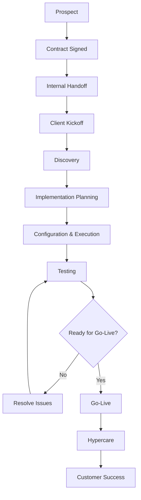
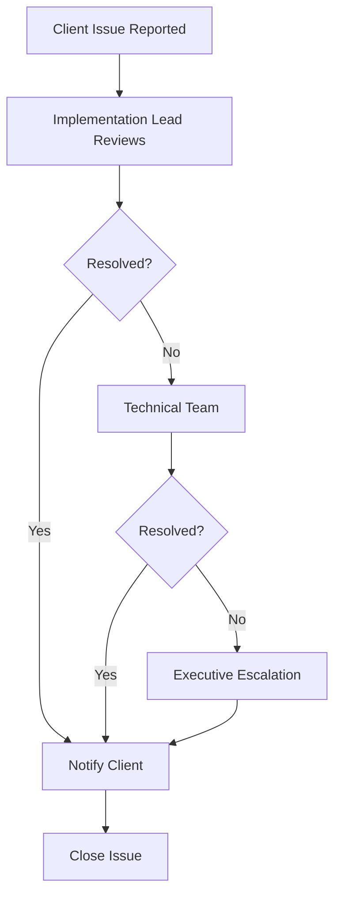
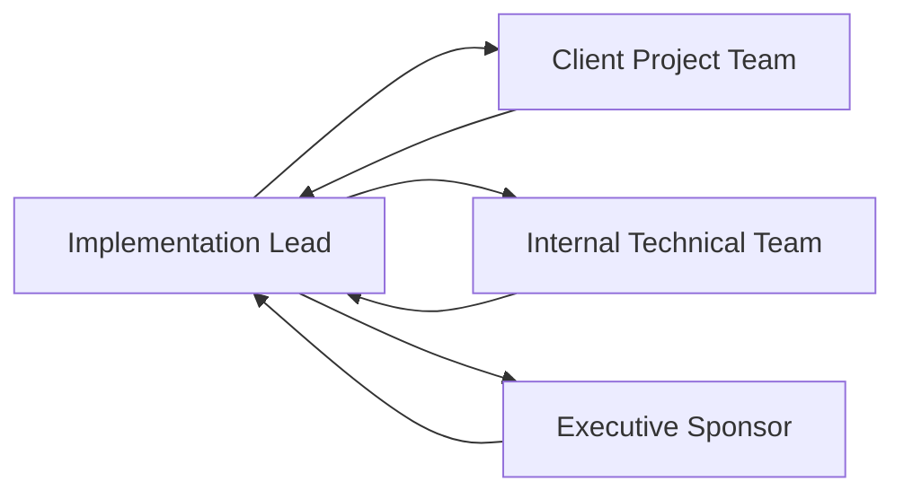
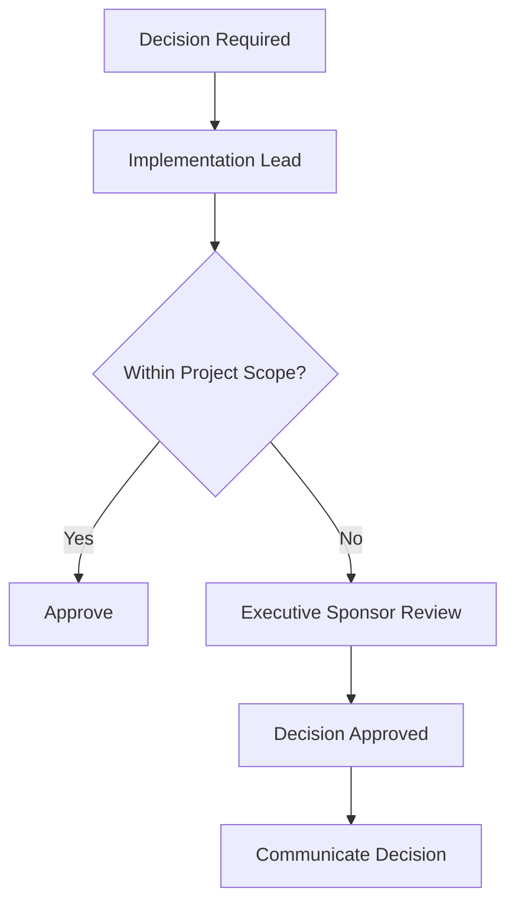

# Implementation Lifecycle Diagrams

This document contains visual process diagrams that support the client implementation lifecycle.

---

# 1. Client Implementation Lifecycle

---

# 2. Client Escalation Workflow

---

# 3. Communication Workflow

---

# 4. Decision Approval Workflow

---

# 5. Internal Handoff Workflow

---

# Purpose

These diagrams illustrate repeatable implementation processes that improve communication, accountability, stakeholder alignment, and operational consistency throughout the client lifecycle.
