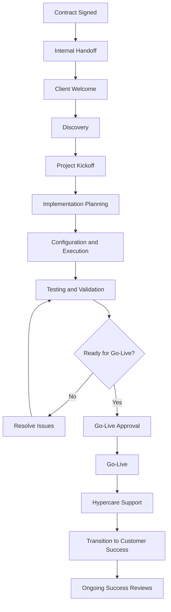

# Client Implementation Workflow

## Overview

This workflow shows how a client moves from contract execution through implementation, launch, and transition into customer success.

---

## Workflow Stages

### 1. Contract Signed

The agreement is executed, and the project scope, SOW, SLA requirements, deadlines, and expected outcomes are confirmed.

### 2. Internal Handoff

Sales, recruiting, account management, or business development transfers project information to the implementation team.

### 3. Client Welcome

The implementation lead introduces the process, confirms next steps, and shares initial documentation.

### 4. Discovery

The team gathers operational, technical, staffing, reporting, security, and workflow requirements.

### 5. Project Kickoff

Stakeholders align on scope, objectives, responsibilities, communication, timeline, risks, and success measures.

### 6. Implementation Planning

The project plan, milestones, owners, dependencies, and deliverables are documented.

### 7. Configuration and Execution

The team completes the required setup, process design, staffing, system configuration, and documentation.

### 8. Testing and Validation

The client and project team verify workflows, documentation, systems, reporting, access, and readiness.

### 9. Go-Live Decision

If requirements are not met, issues are resolved and testing is repeated. If approved, the project moves to launch.

### 10. Hypercare

The implementation team provides focused post-launch support and monitors early issues.

### 11. Customer Success Transition

Ownership shifts into ongoing support, account management, performance reviews, and long-term success planning.

---

## Purpose

The purpose of this workflow is to create a repeatable implementation process that improves accountability, communication, consistency, and client outcomes.
